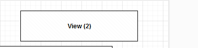
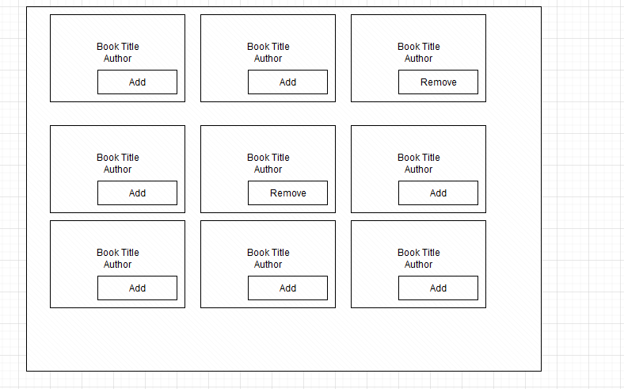
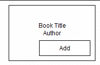
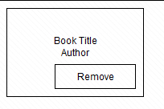

### Book Wish List
Create a reactJS app that allows users to add/remove books to their wish list.

## UI Sections
<ol>
<li>View</li>
Shows number of books that are were added. This also decreases when books are removed.

<li>Book Grid</li>
Shows all the books as nine book tiles fetched from https://openlibrary.org/subjects/health.json?limit=10&offset=0.
 
More book tiles are shown as the user scrolls through. (infinite scroll)

<li>Book Title</li>
Shows a single book in a tile with book title and author. We can add/remove book.
<ul>
<li>Add: When a book is added, update the book counter and set the label as "Remove"

</li>

<li>Remove: When a book is removed, update the book counter and set the label as "Add"

</li>
</ul>

</ol>

### External API

Use https://openlibrary.org/subjects/health.json?limit=10&offset=0 to get list of books.
API query parameters: https://openlibrary.org/dev/docs/api/subjects

### Things we want to see in the App
<ul>
<li>Folder layout and Code organization</li>
<ul>